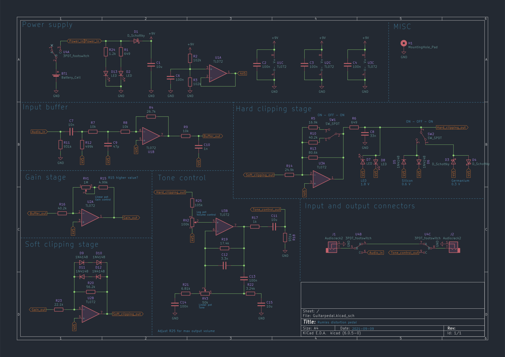
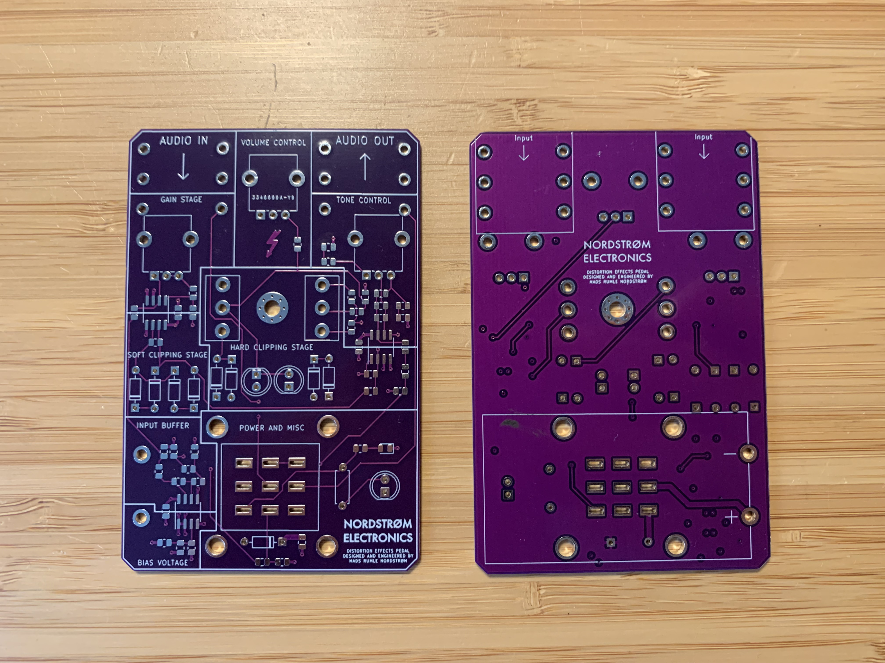
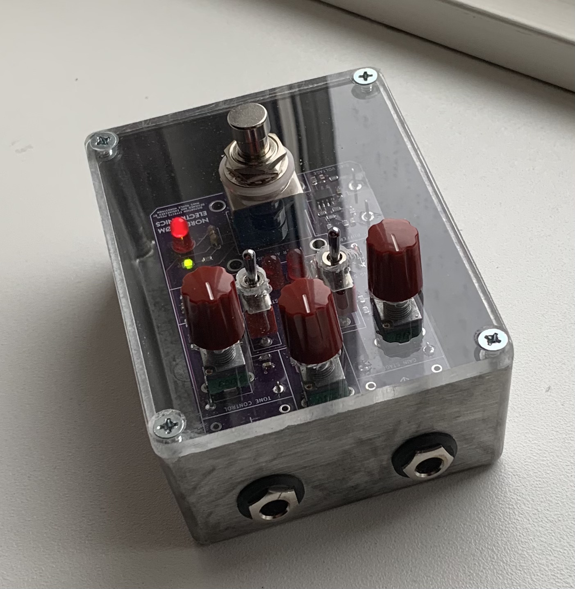

## An open source distortion pedal
The design is all analog and uses diodes to distort the input signal.
It has 3 different modes of distortion. It is possible to either use germanium, silicon or LED's in the hard clipping stage. It is also possible to just use soft clipping.

The PCB is four layers since it so mouch nicer to work with and has become so cheap that two layer PCB are more or less obsolete. I wanted every component to be on the PCB and not having to deal with soldering extra wires to connectors and pots. So when every component is soldered to the PCB, the pedal is essentially done, and just needs to be put into an enclosure. Instead of having a enclosure with art on I designed the PCB to be aesthetically pleasing.

I using an acryllic plate as the lid on an aluminium enclosure, so the PCB is visible. As you can see on the pictures grease and dust becomes very visible on the acryllic lid. Acryllic is also a pain to work with as it is very brittle and can more or less only be cut out nicely on a CO2 laser. Next time I will probably find another material. However I do think the final product turned out nicely!

More pictures can be found in the pictures folder.
Personally I don't play any intrusments. This projects was made as a gift for family and friends. People who have been gifted this pedal like and generally think it sounds good, so I am quite satisfied with the result.